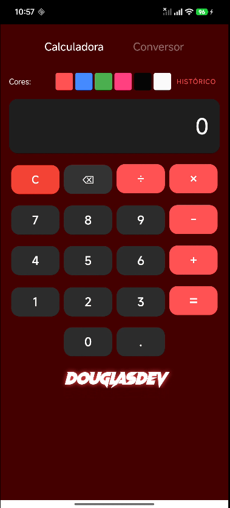
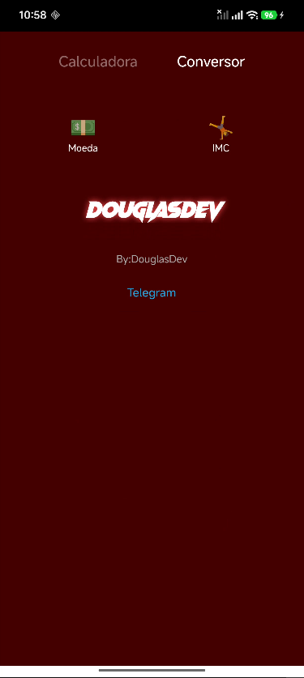
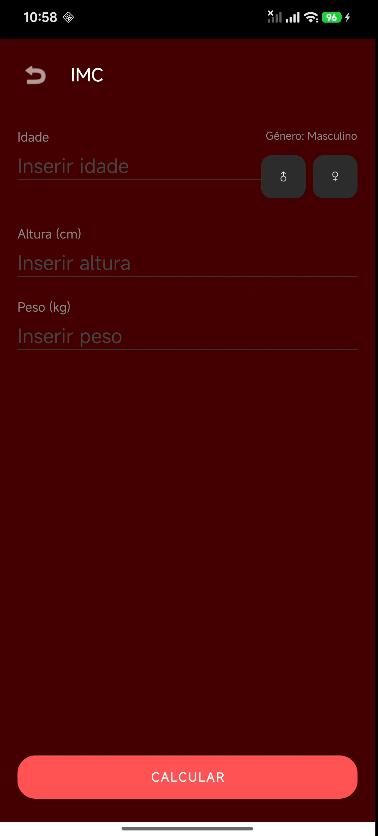

# Calculadora / Calculator

[](https://opensource.org/licenses/MIT)
[](https://developer.android.com)

**Português:** Aplicativo Android com calculadora completa, conversor de moedas em tempo real e cálculo de IMC. Desenvolvido em Java com temas dinâmicos e histórico persistente.  
**English:** Android app featuring a full-featured calculator, real‑time currency converter and BMI calculator. Built with Java, dynamic themes and persistent history.






---

## ✨ Funcionalidades / Features

### Português
- **Calculadora completa** – Suporta expressões com `+`, `-`, `×`, `÷`, e precedência de operadores.
- **Histórico de cálculos** – Salva os últimos resultados e permite limpar.
- **Conversor de moedas** – Cotações em tempo real via AwesomeAPI (BRL, USD, EUR) com teclado numérico dedicado.
- **Cálculo de IMC** – Classificação (subpeso, normal, sobrepeso, obeso) e faixa de peso sugerido.
- **Temas dinâmicos** – 6 opções de cores que alteram o destaque da interface.
- **Persistência de dados** – Histórico e tema escolhido são salvos localmente.

### English
- **Full calculator** – Handles expressions with `+`, `-`, `×`, `÷`, and operator precedence.
- **Calculation history** – Saves recent results with a clear option.
- **Currency converter** – Real‑time rates via AwesomeAPI (BRL, USD, EUR) with a dedicated numeric keypad.
- **BMI calculator** – Classification (underweight, normal, overweight, obese) and suggested weight range.
- **Dynamic themes** – 6 color options that change the accent color of the UI.
- **Data persistence** – History and selected theme are stored locally.

---

## 🛠 Tecnologias / Technologies

| Categoria / Category       | Tecnologias / Technologies                                      |
|----------------------------|----------------------------------------------------------------|
| **Linguagem / Language**   | Java 17                                                        |
| **UI**                     | XML, Material Design (MaterialButton, CardView)                |
| **Requisições HTTP / HTTP**| HttpURLConnection + JSON (AwesomeAPI)                          |
| **Persistência**           | SharedPreferences                                              |
| **SDK mínimo / Min SDK**   | 24 (Android 7.0)                                               |

---

## 📱 Como executar / How to run

### Português
1. Clone o repositório:
   ```bash
   git clone https://github.com/seuusuario/calculadora-douglasdev.git

### English
1. Clone the repository:
   ```bash
   git clone https://github.com/seuusuario/calculadora-douglasdev.git